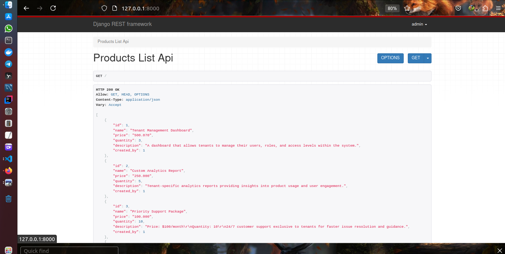
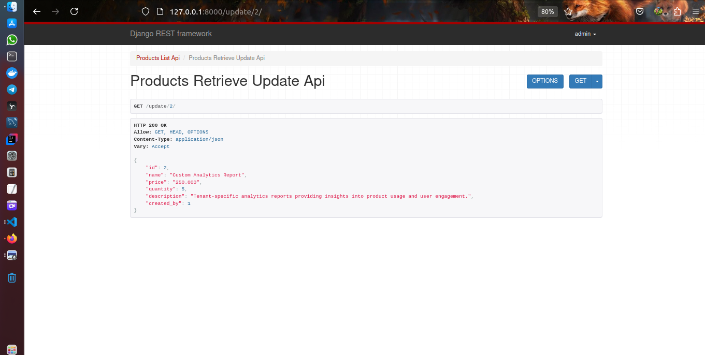
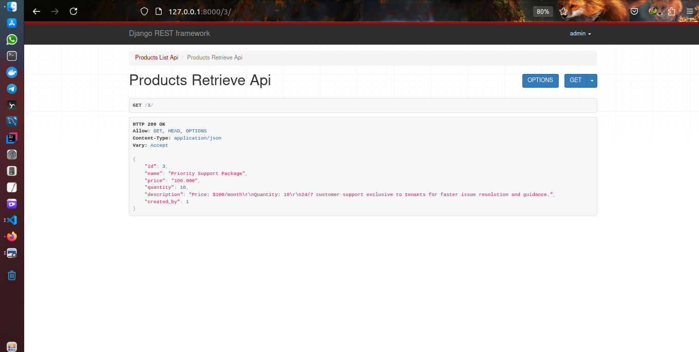
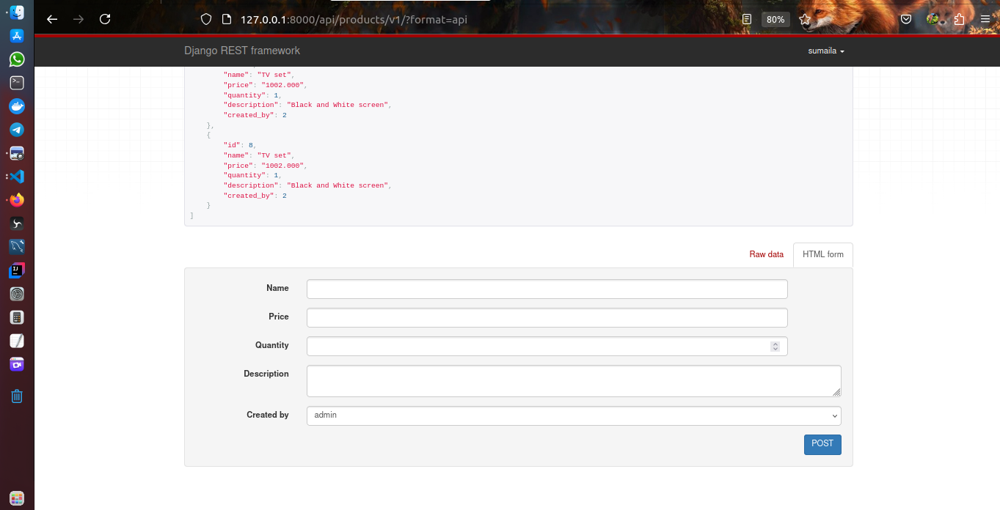
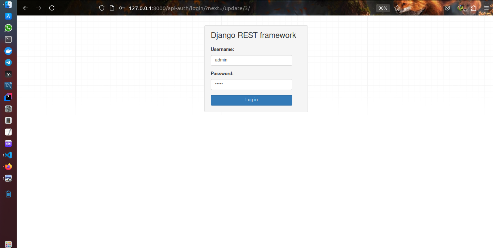

# Note: All commands was done in Linus 

## Steps for setting up the this project
#### 1. Create a folder, you can name it whatever you want, but I named as api_task 
#### 2. Create a virtual environment in the same directory 'api_task', I named mine as env
###### python3 -m venv env   

#### 3. Activate the virtual environment 'env',
##### source env/bin/activate 

#### 4. Install django and django framework 
##### pip install django djangorestframework 

#### 5. Create your django project 
##### django-admin startproject myproject .

#### 6. Create your django application 'myapp'
##### django-admin startapp 'myapp'

##### 7. Define the model  

# How to run the application
### 1. clone this repository 
### 2. cd api_task 
### 3. activate the virtual environment
### 4. Install required packages: pip install -r requirements.txt
### 5. python3 manage.py runserver
### 6. username:admin, password:12345 
### 7. http://127.0.0.1:8000/api/products/v1/

#Screenshots

